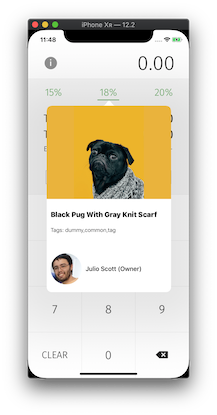

# ToolTipControl

ToolTipControl is a framework that shows a tooltip with particular information from an API. You can see the integrated version with an open source application [here](https://github.com/arvinq/roundandsplit).

### Usage
1. Right-click on your root project node in the project navigator and choose Add Files.... In the file chooser, navigate and select ToolTipControl.xcodeproj. Click Add to add ToolTipControl.xcodeproj as a sub-project.

2. Link the framework into your app by dragging ToolTipControl.framework into the Embedded Binaries of your app target.

3. Go to your main view controller or wherever you want the tooltip to appear and import the ToolTipControl.

4. Select a view on your app which will be the source view of the tooltip.

5. Make an instance of PopTip(), the main view controller of the tooltip.
```
let controller = PopTip()
```
6. Call showToolTip(onItem:) on your instance passing in the view that you want your tooltip to be attached to.
```
controller.showToolTip(onItem: <your view>)
```
7. Present your poptip instance
```
present(controller, animated: true)
```

### API

This app uses this [dummy API](https://dummyapi.io/api/post?limit=1) to provide the details for the tooltip.

### Screenshot

This screenshot was taken from an open source app [roundandsplit](https://github.com/arvinq/roundandsplit) where this framework is integrated to show on the main view.



### Other Version

The Application version of this framework can be seen [here](https://github.com/arvinq/PopTip).

